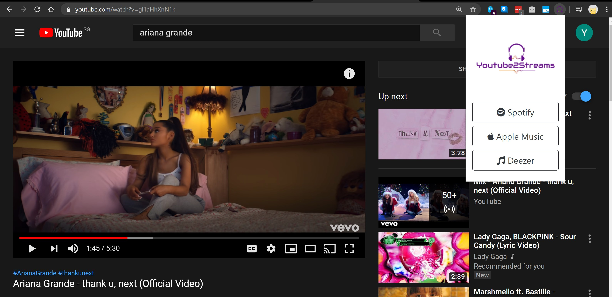
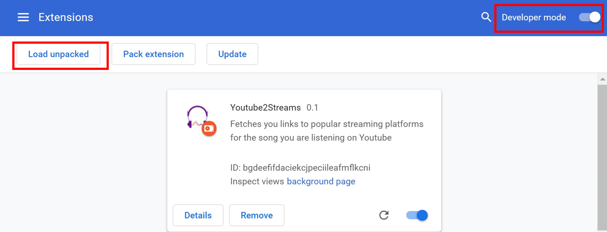

# Youtube2Streams


Youtube2Streams is a Google Chrome extension that automatically fetches links to streaming platforms (e.g. Spotify) for the song you are currently listening to on Youtube.

When a user is on a Youtube watch page, the extension fetches the name of the video (via [Youtube's API](https://developers.google.com/youtube/v3/docs)) and parse it at best effort so that it can be used as query to search for the song on the streaming platforms (just like how you would search for a song on e.g. Spotify).

The extension supoprts the following three streaming platforms for now:
1. Apple Music ([Link to the Official API](https://affiliate.itunes.apple.com/resources/documentation/itunes-store-web-service-search-api/))
2. Deezer ([Link to the Official API](https://developers.deezer.com/api))
3. Spotify ([Link to the Official API](https://developer.spotify.com/documentation/web-api/))

## Installation
As the extension is still on Beta mode, you will need to install it manually.
1. Install the dependencies: 
    ```shell
    $ npm install
    ```
2. Create a `configs.js` file in the `src/` directory. This will contain the keys required to access the APIs. As only Youtube and Spotify's API require secret keys, the `configs.js` file should look like this:
   ```javascript
    var keys = {
        SPOTIFY_CLIENT_ID: "...",
        SPOTIFY_CLIENT_SECRET: "...",
        YOUTUBE_API_KEY: "..."
    };
    export {keys};
   ```
3. Build the extension:
   ```shell
   $ npm run build
   ```
4. In chrome, navigate to `chrome://extensions`
5. Toggle **Developer Mode**
6. Click on the **LOAD UNPACKED** button and select the `dist/` extension directory
   
